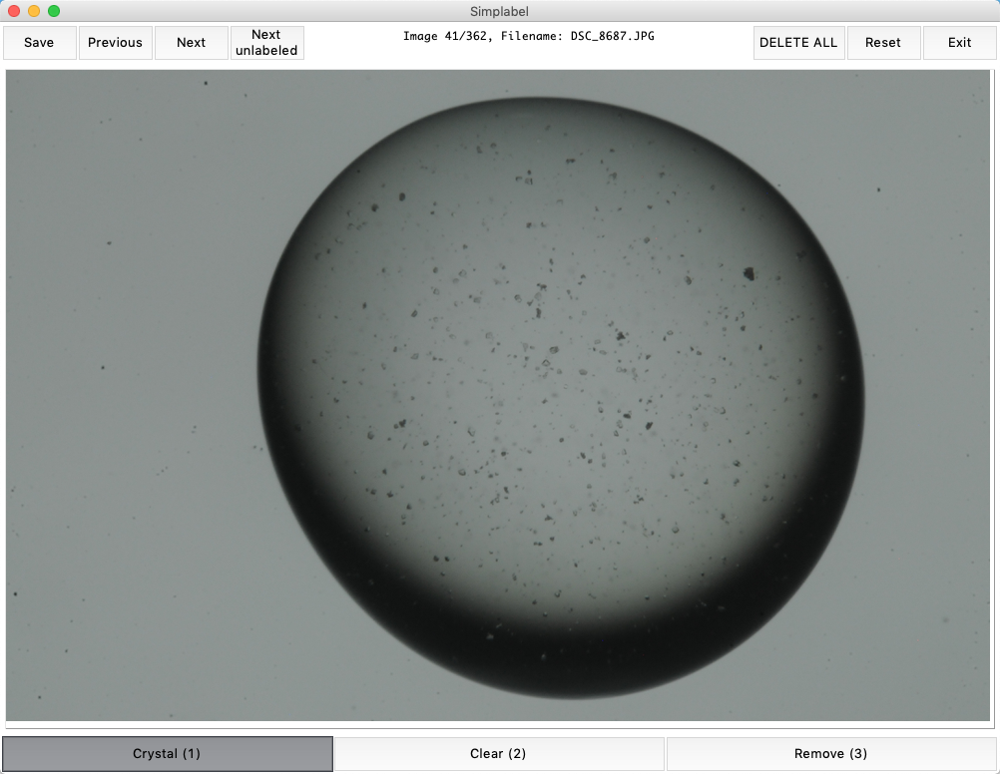

# Simplabel
[](https://badge.fury.io/py/simplabel)

Graphical tool to manually label images in distinct categories to build training datasets.
Simply pass a list of categories, a directory containing images and start labelling.
Supports keyboard bindings to label even faster!



## Installation

### Install with pip

Simplabel is on PyPI so it can be installed with pip

```
pip install simplabel
```

### Install from source

Clone the repository to your computer

```
git clone https://github.com/hlgirard/Simplabel.git
```

and install with pip 

```
cd Simplabel
pip install .
```

## Usage

### Command line tools

Pass the categories and image directory on the command line to start labelling. Use the on-screen buttons to select a label for the current image and advance to the next one. Number keys correspond to labels and can be used instead. A 'remove' label is automatically added to the list of passed categories.

```
simplabel --categories dog cat bird --directory path/to/image/directory
```

After the first use, labels are stored in 'labels.pkl' and there is no need to pass the '--categories' argument unless you want to add labels.
You can also use '--reset' to delete the saved labels and dictionary from the directory before execution.

Once you are done labelling, use the flow_to_directory tool to copy images to distinct directories by label

```
flow_to_directory --rawDirectory data/raw --outDirectory data/labeled
```

### Python object

```python
from simplabel import ImageClassifier
import tkinter as tk

root = tk.Tk() 
directory = "data/raw"
categories = ['dog', 'cat', 'bird']
MyApp = ImageClassifier(root, directory, categories)
tk.mainloop()
```

### Saved labels

The app saves a labeled.pkl file that contains a pickeled dictionary {image_name: label}. To import the dictionary, use the following sample code:

```python
import pickle

with open("labeled.pkl","rb") as f:
    label_dict = pickle.load(f)
```

### Move labeled images to discrete directories

This utility copies labeled images from the raw directory to discrete folders by label in the labelled directory using the dictionary created by simplabel.

```python
from simplabel import utils

utils.flow_to_dict(rawDirectory, labelledDirectory)
```
